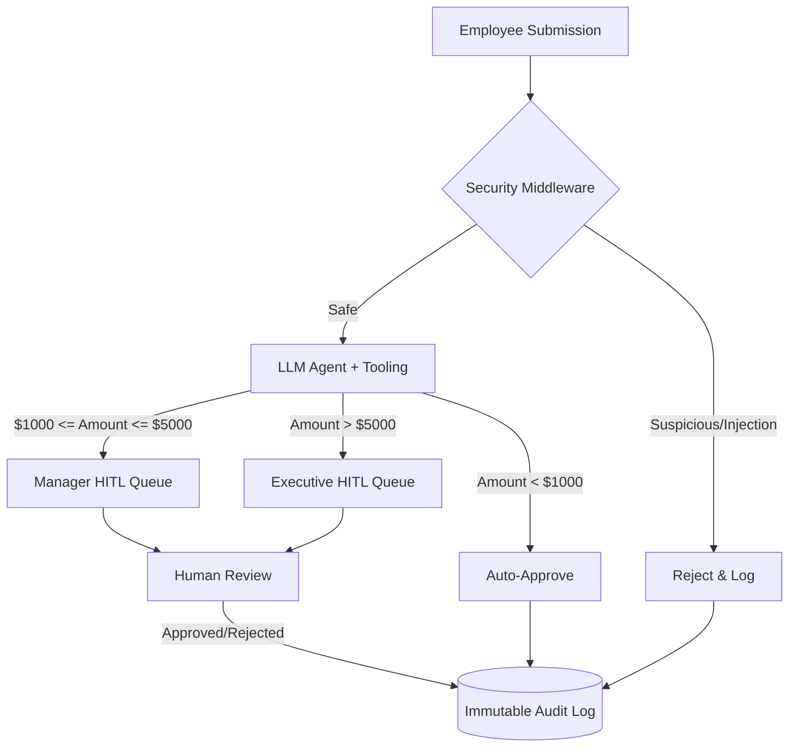

# 🛡️ Secure Expense Approval Agent

[](https://www.python.org/downloads/)
[](https://opensource.org/licenses/MIT)
[]()
[]()

## 📌 Project Overview
The **Secure Expense Approval Agent** is an autonomous AI system designed to streamline corporate expense reporting while maintaining strict financial controls and security boundaries. Powered by the **Google ADK**, this agent evaluates expense requests against business logic, intercepts malicious prompt injections, and intelligently routes high-value or complex requests to human managers through an integrated Human-in-the-Loop (HITL) workflow.

## 🏗️ Architecture Diagram



## 🔄 Human-in-the-Loop (HITL) Workflow
We prioritize corporate financial safety by explicitly defining boundaries where the AI must hand off control:
* **Auto-Approval:** Expenses under `$1000` are validated and approved automatically to reduce administrative overhead.
* **Manager Queue:** Expenses between `$1000` and `$5000` are routed to the `manager` pending queue.
* **Executive Queue:** High-risk expenses over `$5000` mandate `executive` approval. 

Pending queues are processed interactively via our robust CLI tracking system.

## 🔐 Security Features
Security is deeply integrated via our `SecurityMiddleware` interceptor:
- **Prompt Injection Defense:** Blocks adversarial attempts to override instructions (e.g., *"ignore previous instructions"*).
- **Suspicious Content Detection:** Blocks unethical or prohibited expenses (e.g., *cryptocurrency, personal vacations, bribes*).
- **Strict Logic Separation:** Mathematical boundaries are evaluated using strict Python logic (`@tool` decorators), ensuring the LLM cannot hallucinate financial limits.
- **Immutable Auditing:** Every decision (AI or human) is appended to an untamperable JSON audit log.

## 📊 Evaluation Metrics
Our automated test suite (`evaluator.py`) continuously scores the agent against 20 adversarial and standard scenarios:
* **Total Scenarios Tested:** 20
* **False Positives:** 0
* **False Negatives:** 0
* **Approval Accuracy:** 100.0%
* **Security Detection Rate:** 100.0%
* **Overall Trust Score:** 100.0

## ⚙️ Installation

1. Clone the repository:
```bash
git clone https://github.com/your-org/secure-expense-agent.git
cd secure-expense-agent
```

2. Install dependencies:
```bash
pip install -r requirements.txt
```

3. Set up environment variables:
Create a `.env` file and insert your API credentials.

## 🚀 Usage

### 1. Run the Agent Workflow
Test the automated rule-engine and security middleware:
```bash
python adk_agent.py
```

### 2. Process the Human-in-the-Loop Queue
Review expenses that have been routed to managers or executives:
```bash
python agent.py manager
```

### 3. Run Security Evaluation
Execute the robust 20-scenario testing suite to generate an evaluation report:
```bash
python evaluator.py
```

## 🔮 Future Improvements
- [ ] **LLM-as-a-Judge Security:** Transition from hard-coded heuristic regex lists to an LLM-based safety checker for more resilient injection blocking.
- [ ] **Database Migration:** Replace flat JSON files (`audit_log.json`) with a transactional database (e.g., PostgreSQL) to eliminate race conditions.
- [ ] **Schema Validation:** Implement strict bounds checking in Pydantic (e.g., `gt=0`) to prevent negative expense exploits.
- [ ] **Web Dashboard:** Build a Next.js frontend to replace the CLI-based Human-in-the-Loop queue.
